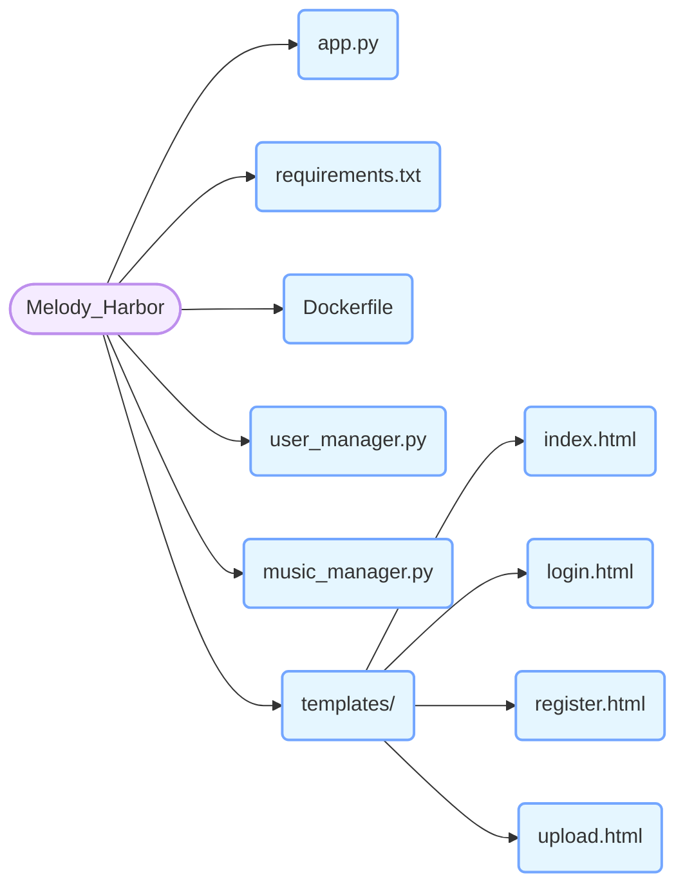

# 旋律港湾 - 音乐分享平台项目文档 🎵

## 一、项目概述
想象一下，你身处一个名为“旋律港湾”的神奇音乐世界 🌊。在这里，你就像一位音乐探险家，能够注册、登录，开启属于自己的音乐之旅。你可以上传自己喜爱的音乐，就像是在港湾里停靠一艘艘装满美妙旋律的船只；还能对音乐进行点赞，仿佛是为这些船只升起一面面赞许的旗帜；要是你上传的音乐，你还能随时将它“驶离”港湾，也就是删除它。这个平台基于 Flask 框架构建，就像为这个音乐世界搭建了一个坚固的码头，使用简单的 JSON 文件存储用户和音乐信息，如同在码头边的仓库里记录着每一艘船的信息。同时，借助 Pillow 库处理音乐封面图片，让每艘船都有一张精美的“照片”。

[点击查看项目代码仓库](此处可替换为实际仓库链接)

## 二、项目结构 📁
下面是项目的结构思维导图，让你更清晰地了解各个文件和文件夹的关系：


### 文件说明
| 文件/文件夹 | 功能描述 |
| ---- | ---- |
| `app.py` | Flask 应用的主文件，就像音乐世界的总指挥，定义了各个路由和视图函数，指挥着音乐的流动和展示。 |
| `requirements.txt` | 项目依赖的 Python 包列表，包含 Flask 和 Pillow，就像是建造码头所需的各种材料清单。 |
| `Dockerfile` | 用于容器化部署的配置文件，如同为码头准备了一艘可以远航的大船，方便项目的部署和迁移。 |
| `user_manager.py` | 负责用户的注册和登录功能，将用户信息存储在 `users` 目录下的 JSON 文件中，好比是码头的安检处，管理着每个进入港湾的人的身份信息。 |
| `music_manager.py` | 处理音乐的上传、获取、删除和点赞操作，音乐信息和封面图片分别存储在 `static/music` 和 `static/music_covers` 目录下，是港湾里的码头管理员，管理着每一艘音乐船只的停靠、离开和受欢迎程度。 |
| `templates/` | 存放 HTML 模板文件，用于渲染不同的页面，就像是码头的各个区域，每个区域都有特定的功能和布局。 |

## 三、功能模块 🎛️

### 用户管理
#### 注册 📝
用户可以在注册页面输入用户名和密码进行注册，就像在港湾里登记自己的身份信息。若用户名已存在，注册失败，仿佛这个位置已经被其他船只占据；否则，将用户信息保存为 JSON 文件，就像给你的船只发放了一张专属的通行证。
```python
# user_manager.py
def register_user(username, password):
    user_file = os.path.join(USER_DATA_DIR, f"{username}.json")
    if os.path.exists(user_file):
        return False
    user_data = {
        "username": username,
        "password": password
    }
    try:
        with open(user_file, "w") as f:
            json.dump(user_data, f)
        return True
    except PermissionError:
        print(f"没有足够的权限写入用户文件 {user_file}。请检查运行环境的权限设置。")
        return False
```

#### 登录 🔑
用户在登录页面输入用户名和密码，系统会验证用户信息。若验证通过，将用户名存储在会话中，并重定向到首页，就像你拿着通行证顺利进入港湾，开启音乐之旅；否则，提示用户名或密码无效，仿佛你的通行证是假的，无法进入。
```python
# user_manager.py
def login_user(username, password):
    user_file = os.path.join(USER_DATA_DIR, f"{username}.json")
    if not os.path.exists(user_file):
        return False
    try:
        with open(user_file, "r") as f:
            user_data = json.load(f)
        return user_data["password"] == password
    except PermissionError:
        print(f"没有足够的权限读取用户文件 {user_file}。请检查运行环境的权限设置。")
        return False
```

#### 注销 🚪
用户点击注销按钮后，会话中的用户名会被移除，并重定向到登录页面，就像你结束了这次音乐之旅，离开了港湾。
```python
# app.py
@app.route("/logout")
def logout():
    session.pop("username", None)
    return redirect("/login")
```

### 音乐管理
#### 上传 🎵
已登录用户可以在上传页面选择音乐文件、填写音乐信息（标题、艺术家、歌词）和封面图片进行上传。上传成功后，音乐文件、封面图片和音乐信息会分别保存到相应目录，并返回首页，就像你成功地将一艘装满美妙旋律的船只停靠在了港湾；否则，提示上传失败，仿佛船只在停靠时遇到了阻碍。
```python
# music_manager.py
def upload_music(file, title, artist, username, lyrics=None, cover_file=None):
    if not allowed_file(file.filename, ALLOWED_MUSIC_EXTENSIONS):
        return False
    try:
        # 保存音乐文件
        music_filename = f"{title}_{artist}.{file.filename.rsplit('.', 1)[1].lower()}"
        music_path = os.path.join(MUSIC_DATA_DIR, music_filename)
        file.save(music_path)

        # 处理封面图片
        cover_filename = None
        if cover_file:
            if allowed_file(cover_file.filename, ALLOWED_IMAGE_EXTENSIONS):
                cover_filename = f"{title}_{artist}.{cover_file.filename.rsplit('.', 1)[1].lower()}"
                cover_path = os.path.join(COVER_DATA_DIR, cover_filename)
                cover_file.save(cover_path)
                with Image.open(cover_path) as img:
                    img.thumbnail((100, 100))
                    img.save(cover_path)

        # 保存音乐信息
        music_info = {
            "title": title,
            "artist": artist,
            "username": username,
            "filename": music_filename,
            "lyrics": lyrics,
            "cover_filename": cover_filename,
            "likes": 0
        }
        info_filename = f"{title}_{artist}.json"
        info_path = os.path.join(MUSIC_DATA_DIR, info_filename)
        with open(info_path, "w") as f:
            json.dump(music_info, f)
        return True
    except PermissionError:
        print("没有足够的权限上传音乐或保存相关信息。请检查运行环境的权限设置。")
        return False
    except Exception as e:
        print(f"Upload error: {e}")
        return False
```

#### 获取所有音乐信息 🎧
系统会读取 `static/music` 目录下的所有 JSON 文件，将音乐信息存储在列表中并返回，就像港湾管理员将所有船只的信息整理出来供你查看。
```python
# music_manager.py
def get_all_music_info():
    music_info_list = []
    try:
        for filename in os.listdir(MUSIC_DATA_DIR):
            if filename.endswith(".json"):
                info_path = os.path.join(MUSIC_DATA_DIR, filename)
                with open(info_path, "r") as f:
                    music_info = json.load(f)
                    music_info_list.append(music_info)
        return music_info_list
    except PermissionError:
        print("没有足够的权限读取音乐信息。请检查运行环境的权限设置。")
        return []
```

#### 删除音乐 🗑️
已登录用户可以删除自己上传的音乐。系统会先检查音乐信息文件是否存在，若存在且用户名匹配，则删除音乐文件、封面图片和音乐信息文件，就像你将自己停靠在港湾的船只开走了。
```python
# music_manager.py
def delete_music(filename, username):
    info_filename = filename.rsplit('.', 1)[0] + '.json'
    info_path = os.path.join(MUSIC_DATA_DIR, info_filename)
    if os.path.exists(info_path):
        try:
            with open(info_path, "r") as f:
                music_info = json.load(f)
            if music_info["username"] == username:
                music_path = os.path.join(MUSIC_DATA_DIR, music_info["filename"])
                if os.path.exists(music_path):
                    os.remove(music_path)
                if "cover_filename" in music_info and music_info["cover_filename"]:
                    cover_path = os.path.join(COVER_DATA_DIR, music_info["cover_filename"])
                    if os.path.exists(cover_path):
                        os.remove(cover_path)
                os.remove(info_path)
                return True
        except PermissionError:
            print("没有足够的权限删除音乐。请检查运行环境的权限设置。")
    return False
```

#### 点赞音乐 👍
已登录用户可以对音乐进行点赞操作。系统会更新音乐信息文件中的点赞数，就像你为一艘喜欢的船只升起了一面赞许的旗帜，让它更加引人注目。
```python
# music_manager.py
def like_music(filename):
    info_filename = filename.rsplit('.', 1)[0] + '.json'
    info_path = os.path.join(MUSIC_DATA_DIR, info_filename)
    if os.path.exists(info_path):
        try:
            with open(info_path, "r") as f:
                music_info = json.load(f)
            music_info["likes"] += 1
            with open(info_path, "w") as f:
                json.dump(music_info, f)
            return True
        except PermissionError:
            print("没有足够的权限更新音乐点赞信息。请检查运行环境的权限设置。")
    return False
```

## 四、安装与运行 🚀

### 安装依赖
```bash
pip install -r requirements.txt
```

### 运行项目
```bash
python app.py
```

### 访问项目
在浏览器中访问 `http://127.0.0.1:5000` 即可进入音乐分享平台，开启你的音乐之旅啦！🎉

## 五、注意事项 ⚠️
1. 确保运行环境具有足够的权限来创建和操作文件和目录，不然你的船只可能无法顺利停靠或离开港湾哦。
2. 项目使用 JSON 文件存储数据，适用于小型应用。在生产环境中，建议使用数据库（如 MySQL、PostgreSQL）来存储数据，就像将小码头升级为大港口，更能容纳大量的船只。
3. 项目的 `secret_key` 使用 `os.urandom(24)` 生成，在生产环境中应使用固定的安全密钥，就像为你的港湾设置一把更安全的锁。 

##六、联系方式
QQ：308328889（炽阳001）
联系时请注明原因