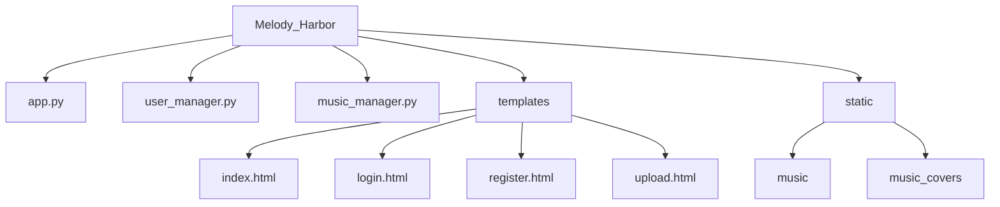

# 旋律港湾 - 音乐分享平台项目文档

## 一、项目概述
“旋律港湾 - 音乐分享平台” 是一个基于 Flask 框架开发的 Web 应用程序，用户可以在该平台上注册、登录、上传音乐、删除自己上传的音乐、点赞音乐等😎。该项目通过将用户信息和音乐信息存储在本地文件系统中，实现了基本的音乐分享功能。

## 二、项目结构
```plaintext
Melody_Harbor/
│
├── app.py                # 主应用程序文件
├── user_manager.py       # 用户管理模块
├── music_manager.py      # 音乐管理模块
│
├── templates/            # HTML 模板文件
│   ├── index.html
│   ├── login.html
│   ├── register.html
│   ├── upload.html
│
├── static/               # 静态文件目录
│   ├── music/            # 音乐文件存储目录
│   ├── music_covers/     # 音乐封面文件存储目录
```

### 项目结构思维导图


## 三、功能模块

### 功能模块表格
| 功能模块 | 功能描述 |
| ---- | ---- |
| 用户管理 | 包含注册、登录、注销功能。注册时检查用户名是否已存在；登录时验证用户名和密码；注销时清除会话信息。 |
| 音乐管理 | 支持上传、删除和点赞音乐。上传时检查文件格式；删除时仅允许用户删除自己上传的音乐；点赞时更新音乐的点赞数。 |
| 音乐展示 | 已登录用户可在首页看到所有音乐列表，包括音乐封面、标题、艺术家等信息，还可进行播放、点赞、分享和删除操作。 |

### 功能模块详细介绍

#### 1. 用户管理
- **注册**：用户可以输入用户名和密码进行注册，系统会检查用户名是否已存在，若不存在则将用户信息保存到本地文件中👍。
- **登录**：用户输入用户名和密码进行登录，系统会验证用户名和密码的正确性，若正确则将用户信息保存到会话中。
- **注销**：用户可以点击注销按钮，系统会清除会话中的用户信息，并将用户重定向到登录页面。

#### 2. 音乐管理
- **上传**：已登录用户可以上传音乐文件、音乐封面和填写音乐标题、艺术家、歌词等信息，系统会检查文件格式是否允许，若允许则将音乐文件和相关信息保存到本地文件中。
- **删除**：已登录用户可以删除自己上传的音乐，系统会删除音乐文件、音乐封面文件和相关信息文件。
- **点赞**：已登录用户可以对音乐进行点赞，系统会更新音乐信息中的点赞数。

#### 3. 音乐展示
- **首页**：已登录用户可以在首页看到所有音乐的列表，包括音乐封面、标题、艺术家、上传者、歌词、音频播放器、点赞按钮、分享按钮和删除按钮（仅自己上传的音乐可见）。

## 四、代码实现

### 1. `app.py`
```python
# 音乐分享平台/app.py
from flask import Flask, render_template, request, redirect, session
from user_manager import register_user, login_user
from music_manager import upload_music, get_all_music_info, delete_music, like_music

app = Flask(__name__)
app.secret_key = "your_secret_key"

@app.route("/")
def index():
    if "username" not in session:
        return redirect("/login")
    music_list = get_all_music_info()
    return render_template("index.html", music_list=music_list)

@app.route("/register", methods=["GET", "POST"])
def register():
    if request.method == "POST":
        username = request.form.get("username")
        password = request.form.get("password")
        if register_user(username, password):
            return redirect("/login")
        else:
            return "用户名已存在。"
    return render_template("register.html")

@app.route("/login", methods=["GET", "POST"])
def login():
    if request.method == "POST":
        username = request.form.get("username")
        password = request.form.get("password")
        if login_user(username, password):
            session["username"] = username
            return redirect("/")
        else:
            return "用户名或密码无效。"
    return render_template("login.html")

@app.route("/logout")
def logout():
    session.pop("username", None)
    return redirect("/login")

@app.route("/upload", methods=["GET", "POST"])
def upload():
    if "username" not in session:
        return redirect("/login")
    if request.method == "POST":
        file = request.files["file"]
        title = request.form.get("title")
        artist = request.form.get("artist")
        lyrics = request.form.get("lyrics")
        cover_file = request.files.get("cover")
        username = session["username"]
        if upload_music(file, title, artist, username, lyrics, cover_file):
            return redirect("/")
        else:
            return "上传失败，请检查文件格式。"
    return render_template("upload.html")

@app.route("/delete_music/<filename>")
def delete(filename):
    if "username" not in session:
        return redirect("/login")
    username = session["username"]
    if delete_music(filename, username):
        return redirect("/")
    else:
        return "删除失败。"

@app.route("/like_music/<filename>")
def like(filename):
    if "username" not in session:
        return redirect("/login")
    if like_music(filename):
        return redirect("/")
    else:
        return "点赞失败。"

if __name__ == "__main__":
    app.run(debug=True)
```

### 2. `user_manager.py`
```python
import os
import json

# 用户数据存储路径
USER_DATA_DIR = r"D:\Website_Data\users"
if not os.path.exists(USER_DATA_DIR):
    os.makedirs(USER_DATA_DIR)

def register_user(username, password):
    """
    注册新用户
    :param username: 用户名
    :param password: 密码
    :return: 注册成功返回True，失败返回False
    """
    user_file = os.path.join(USER_DATA_DIR, f"{username}.json")
    if os.path.exists(user_file):
        return False
    user_data = {
        "username": username,
        "password": password
    }
    with open(user_file, "w") as f:
        json.dump(user_data, f)
    return True

def login_user(username, password):
    """
    用户登录
    :param username: 用户名
    :param password: 密码
    :return: 登录成功返回True，失败返回False
    """
    user_file = os.path.join(USER_DATA_DIR, f"{username}.json")
    if not os.path.exists(user_file):
        return False
    with open(user_file, "r") as f:
        user_data = json.load(f)
    return user_data["password"] == password
```

### 3. `music_manager.py`
```python
import os
import json
from PIL import Image

# 音乐数据存储路径，确保这些路径是 static 目录的子目录
MUSIC_DATA_DIR = r"static/music"
COVER_DATA_DIR = r"static/music_covers"
if not os.path.exists(MUSIC_DATA_DIR):
    os.makedirs(MUSIC_DATA_DIR)
if not os.path.exists(COVER_DATA_DIR):
    os.makedirs(COVER_DATA_DIR)

ALLOWED_MUSIC_EXTENSIONS = {'mp3', 'wav', 'ogg', 'flac'}
ALLOWED_IMAGE_EXTENSIONS = {'png', 'jpg', 'jpeg', 'gif'}

def allowed_file(filename, allowed_extensions):
    return '.' in filename and filename.rsplit('.', 1)[1].lower() in allowed_extensions

def upload_music(file, title, artist, username, lyrics=None, cover_file=None):
    """
    上传音乐文件并保存相关信息
    :param file: 音乐文件对象
    :param title: 音乐标题
    :param artist: 音乐艺术家
    :param username: 上传者用户名
    :param lyrics: 音乐歌词
    :param cover_file: 音乐封面文件对象
    :return: 上传成功返回True，失败返回False
    """
    if not allowed_file(file.filename, ALLOWED_MUSIC_EXTENSIONS):
        return False
    try:
        music_filename = f"{title}_{artist}.{file.filename.rsplit('.', 1)[1].lower()}"
        music_path = os.path.join(MUSIC_DATA_DIR, music_filename)
        file.save(music_path)

        cover_filename = None
        if cover_file:
            if allowed_file(cover_file.filename, ALLOWED_IMAGE_EXTENSIONS):
                cover_filename = f"{title}_{artist}.{cover_file.filename.rsplit('.', 1)[1].lower()}"
                cover_path = os.path.join(COVER_DATA_DIR, cover_filename)
                cover_file.save(cover_path)
                # 裁剪图片到合适大小
                with Image.open(cover_path) as img:
                    img.thumbnail((100, 100))
                    img.save(cover_path)

        music_info = {
            "title": title,
            "artist": artist,
            "username": username,
            "filename": music_filename,
            "lyrics": lyrics,
            "cover_filename": cover_filename,
            "likes": 0
        }
        info_filename = f"{title}_{artist}.json"
        info_path = os.path.join(MUSIC_DATA_DIR, info_filename)
        with open(info_path, "w") as f:
            json.dump(music_info, f)
        return True
    except Exception as e:
        print(f"Upload error: {e}")
        return False

def get_all_music_info():
    """
    获取所有音乐的信息
    :return: 包含所有音乐信息的列表
    """
    music_info_list = []
    for filename in os.listdir(MUSIC_DATA_DIR):
        if filename.endswith(".json"):
            info_path = os.path.join(MUSIC_DATA_DIR, filename)
            with open(info_path, "r") as f:
                music_info = json.load(f)
                music_info_list.append(music_info)
    return music_info_list

def delete_music(filename, username):
    """
    删除指定用户上传的音乐
    :param filename: 音乐文件名
    :param username: 用户名
    :return: 删除成功返回True，失败返回False
    """
    info_filename = filename.rsplit('.', 1)[0] + '.json'
    info_path = os.path.join(MUSIC_DATA_DIR, info_filename)
    if os.path.exists(info_path):
        with open(info_path, "r") as f:
            music_info = json.load(f)
        if music_info["username"] == username:
            music_path = os.path.join(MUSIC_DATA_DIR, music_info["filename"])
            if os.path.exists(music_path):
                os.remove(music_path)
            # 检查 cover_filename 键是否存在
            if "cover_filename" in music_info and music_info["cover_filename"]:
                cover_path = os.path.join(COVER_DATA_DIR, music_info["cover_filename"])
                if os.path.exists(cover_path):
                    os.remove(cover_path)
            os.remove(info_path)
            return True
    return False

def like_music(filename):
    info_filename = filename.rsplit('.', 1)[0] + '.json'
    info_path = os.path.join(MUSIC_DATA_DIR, info_filename)
    if os.path.exists(info_path):
        with open(info_path, "r") as f:
            music_info = json.load(f)
        music_info["likes"] += 1
        with open(info_path, "w") as f:
            json.dump(music_info, f)
        return True
    return False
```

## 五、运行步骤
1. 确保你已经安装了 Python 和所需的库，如 Flask、Pillow 等。
2. 克隆项目代码到本地。
3. 修改 `user_manager.py` 中的 `USER_DATA_DIR` 和 `music_manager.py` 中的 `MUSIC_DATA_DIR`、`COVER_DATA_DIR` 为你本地的实际路径。
4. 打开终端，进入项目目录。
5. 运行以下命令启动应用程序：
```bash
python app.py
```
6. 打开浏览器，访问 `http://127.0.0.1:5000` 即可看到应用程序的首页😃。

## 六、ngrok 内网穿透方法

### 1. 下载并安装 ngrok
- 访问 [ngrok 官方网站](https://ngrok.com/) 注册账号。
- 下载适合你操作系统的 ngrok 客户端解压下载的文件到一个目录，例如 `C:\ngrok`（Windows Powershell该步骤可跳过，直接执行第二条命令亦可自动安装ngrok并配置文件）。

### 2. 配置 ngrok
- 打开终端，进入 ngrok 所在的目录，例如：
```bash
cd C:\ngrok
```
- 使用你的 ngrok 账号的认证令牌进行配置，命令如下：
```bash
ngrok config add-authtoken YOUR_AUTH_TOKEN
```
其中 `your_auth_token` 是你在 ngrok 官网获取的认证令牌。

### 3. 启动内网穿透
- 确保你的 Flask 应用程序已经在本地运行，默认端口是 5000。
- 在终端中运行以下命令启动 ngrok 并将本地的 5000 端口映射到外网：
```bash
ngrok http 5000
```
- 运行成功后，ngrok 会生成一个外网访问地址，类似 `http://xxxxxx.ngrok.io` 和 `https://xxxxxx.ngrok.io`，你可以将这个地址分享给其他人，他们就可以通过这个地址访问你本地运行的应用程序了🎉。

## 七、注意事项
- 项目中使用的密码存储方式是明文存储，在实际生产环境中，建议使用加密算法对密码进行加密存储🔒。
- 项目中使用的文件存储方式仅适用于小型项目，在实际生产环境中，建议使用数据库来存储用户信息和音乐信息。
- 使用 ngrok 进行内网穿透时，免费版的 ngrok 会在每次启动时生成不同的外网访问地址，且有一定的访问限制。如果需要更稳定的服务，可以考虑使用付费版。